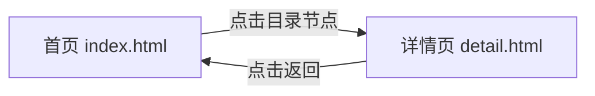
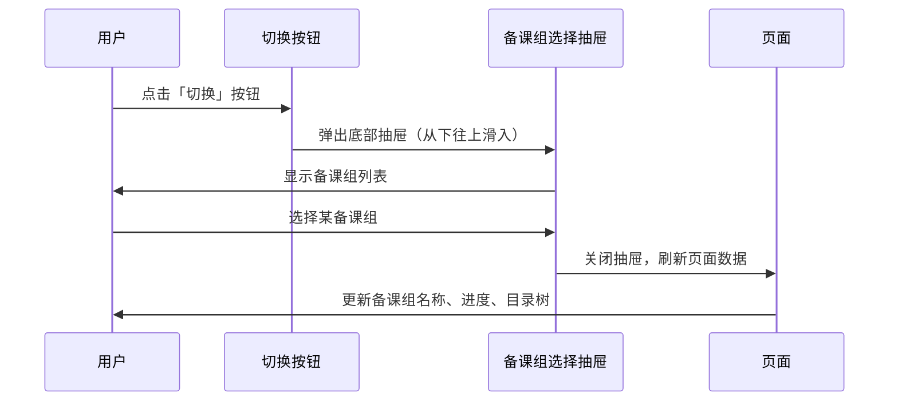
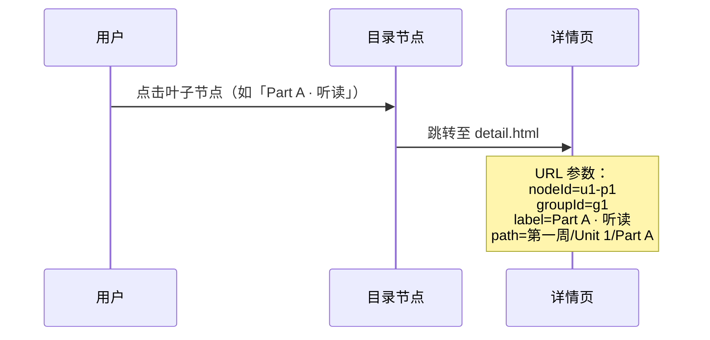
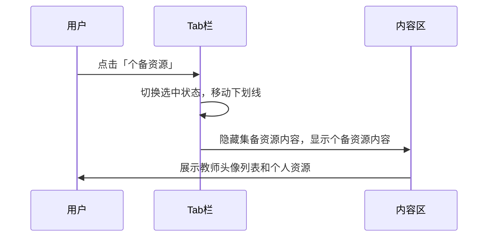
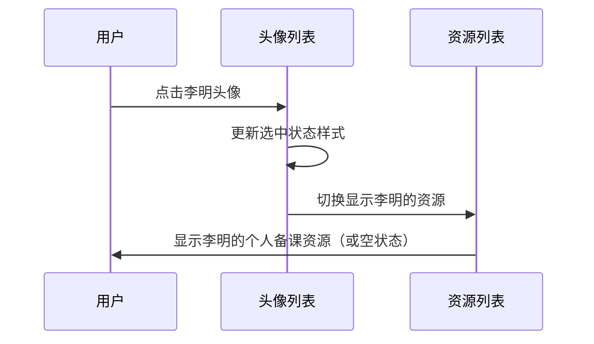
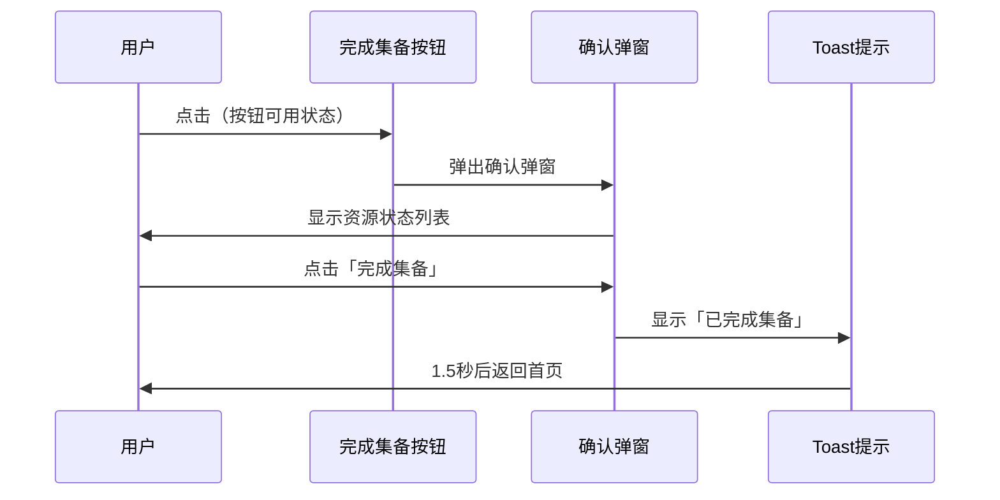
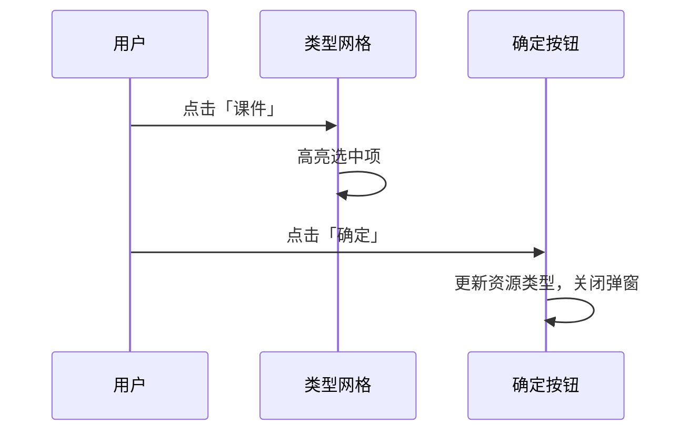
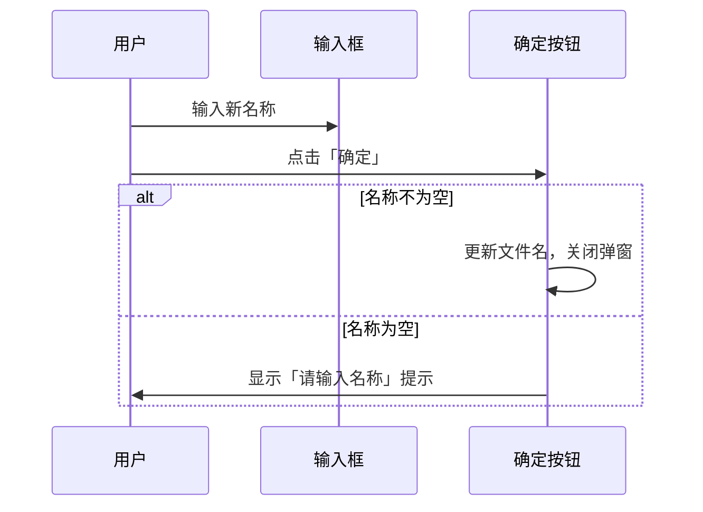

# 集体备课 H5 端产品需求文档（PRD）

---

## 1. 项目概述

### 1.1 项目背景
本项目为集体备课系统的 H5 端实现，旨在为教师提供移动端备课资源管理能力。系统支持备课组管理、教学内容目录树浏览、集备资源与个备资源的上传/查看/编辑等核心功能，是 PC 端集体备课系统的移动端延伸，适用于小程序内嵌场景。

### 1.2 项目目标
| 目标类型 | 具体内容 |
|----------|----------|
| 功能迁移 | 将 PC 端集体备课核心功能完整迁移至 H5 端 |
| 体验优化 | 针对移动端特性优化交互体验，支持触摸操作 |
| 性能优化 | 轻量无依赖，快速加载，流畅运行 |
| 兼容性 | 适配主流手机浏览器及微信小程序环境 |

### 1.3 技术架构
| 层级 | 技术 | 说明 |
|------|------|------|
| 前端框架 | 原生 HTML5/CSS3/JavaScript (ES6+) | 轻量无框架依赖，适合小程序内嵌场景 |
| 样式方案 | CSS3 Flexbox + Grid | 响应式布局，适配各种屏幕尺寸 |
| 数据层 | Mock 数据模拟 | 使用模拟数据进行原型开发，便于前后端分离 |
| 状态管理 | 原生 JavaScript 对象状态管理 | 简单直接，无需引入状态管理库 |

### 1.4 用户角色与权限
| 角色 | 权限说明 |
|------|----------|
| 主备人 | 可上传/编辑/删除集备资源，可完成集备 |
| 普通教师 | 可查看集备资源，可上传/管理个备资源 |

---

## 2. 页面结构与跳转关系

### 2.1 页面总览



### 2.2 页面导航结构图

| 页面 | URL | 入口 | 出口 |
|------|-----|------|------|
| 首页 | index.html | 小程序入口 | 点击目录节点 → 详情页 |
| 详情页 | detail.html?nodeId=xxx&groupId=xxx | 首页目录节点点击 | 点击返回 → 首页 |

---

## 3. 首页详细设计（index.html）

### 3.1 页面布局结构

```
┌─────────────────────────────────────────┐
│           顶部导航栏（固定）              │
│   [←]       集体备课        [空白占位]    │
├─────────────────────────────────────────┤
│           备课组信息区（固定）            │
│   一年级英语备课              [切换 ▾]    │
│           个备进度：32%                  │
├─────────────────────────────────────────┤
│           目录树区域（可滚动）            │
│   ├─ 第一周                             │
│   │   ├─ Unit 1 Helping at home         │
│   │   │   ├─ Part A · 听读  集/个/思    │
│   │   │   └─ Part B · 对话  集/个       │
│   │   └─ Chapter 1 ...                  │
│   │       └─ Lesson 1  集/个/思         │
│   └─ 第二周                             │
│       └─ ...                            │
└─────────────────────────────────────────┘
```

### 3.2 页面模块详解

#### 3.2.1 顶部导航栏

| 元素 | 描述 | 交互 |
|------|------|------|
| 返回按钮 | 左箭头图标 | 点击返回上一页（小程序场景） |
| 标题 | 「集体备课」文字 | 静态展示 |
| 右侧占位 | 空白区域 | 保持布局对称 |

**样式规范**：
- 高度：56px
- 背景：渐变背景（#6366f1 → #4f46e5）
- 文字颜色：白色
- 标题字号：17px，字重 600

#### 3.2.2 备课组信息区（固定置顶）

| 元素 | 描述 | 交互 |
|------|------|------|
| 备课组名称 | 当前选中备课组名称，如「一年级英语备课」 | 静态展示 |
| 组长标识 | 若当前用户为组长，显示「组长」角标 | 静态展示 |
| 切换按钮 | 文字「切换」+ 下拉箭头图标 | 点击弹出底部抽屉 |
| 个备进度条 | 显示个人备课完成进度百分比 | 静态展示 |

**交互流程**：


#### 3.2.3 备课组选择抽屉

| 元素 | 描述 | 交互 |
|------|------|------|
| 遮罩层 | 半透明黑色背景 | 点击关闭抽屉 |
| 抽屉标题 | 「选择备课组」 | 静态展示 |
| 备课组列表 | 每个条目显示：名称、组长标识、个备进度 | 点击选择 |
| 当前选中标识 | 蓝色勾选图标 | 静态展示 |

**列表项结构**：
```
┌────────────────────────────────┐
│ 一年级英语备课                │
│ 组长 · 个备进度 32%          │
│                    [✓]        │
├────────────────────────────────┤
│ 二年级数学备课                │
│      · 个备进度 58%          │
└────────────────────────────────┘
```

#### 3.2.4 目录树区域（可滚动）

| 元素 | 描述 | 交互 |
|------|------|------|
| 目录节点 | 显示层级结构（周 → 单元/章节 → 课时） | 点击叶子节点跳转到详情页 |
| 状态标识 | 「集」「个」「思」三种状态标签 | 静态展示 |
| 层级缩进 | 每级缩进 16px | 视觉区分层级 |

**状态标识规则**：
| 标识 | 颜色 | 含义 | 显示条件 |
|------|------|------|----------|
| 集 | 绿色 #10b981 | 已完成集体备课 | 集体备课资源已上传 |
| 个 | 灰色 #9ca3af | 已完成个人备课 | 个人备课资源已上传 |
| 思 | 红色 #ef4444 | 有待反思改进 | 标记需要反思 |

**交互流程**：


### 3.3 首页交互细节

#### 3.3.1 滚动行为
- 备课组信息区固定置顶，不随滚动移动
- 目录树区域可上下滚动
- 滚动时状态栏样式不变

#### 3.3.2 点击反馈
- 点击叶子节点时有高亮效果（背景色变化）
- 跳转时有平滑过渡动画

---

## 4. 详情页详细设计（detail.html）

### 4.1 页面布局结构

```
┌─────────────────────────────────────────┐
│           顶部导航栏（固定）              │
│   [←]      Part A · 听读    [空白占位]   │
├─────────────────────────────────────────┤
│           Tab 切换栏（固定）              │
│   ┌──────────┬──────────┐               │
│   │ 集备资源 │ 个备资源 │               │
│   └──────────┴──────────┘               │
├─────────────────────────────────────────┤
│           路径导航（静态）                │
│   一年级英语备课 / Unit 1 / Part A       │
├─────────────────────────────────────────┤
│           内容区域（可滚动）              │
│                                         │
│   ┌─────────────────────────────────┐   │
│   │ 【集备资源 Tab】                 │   │
│   │ 主备人：冯佳华  [教案 ✓] [课件]   │   │
│   │                                 │   │
│   │  ┌─────────────────────────┐    │   │
│   │  │ DOC 文件名.docx          │    │   │
│   │  │ 教案 · 1.8 MB           │    │   │
│   │  │ [编辑] [+个备] [...]     │    │   │
│   │  └─────────────────────────┘    │   │
│   │                                 │   │
│   │  + 上传资源（还可上传 7/10）     │   │
│   └─────────────────────────────────┘   │
│                                         │
│   ┌─────────────────────────────────┐   │
│   │ 【个备资源 Tab】                 │   │
│   │  ┌────┬────┬────┬────┐         │   │
│   │  │ 冯 │ 李 │ 王 │ 张 │         │   │
│   │  └────┴────┴────┴────┘         │   │
│   │                                 │   │
│   │  ┌─────────────────────────┐    │   │
│   │  │ 文件列表...             │    │   │
│   │  └─────────────────────────┘    │   │
│   │                                 │   │
│   │  + 上传资源（还可上传 8/10）     │   │
│   └─────────────────────────────────┘   │
├─────────────────────────────────────────┤
│           底部按钮栏（固定）              │
│           [完成集备]                     │
└─────────────────────────────────────────┘
```

### 4.2 页面模块详解

#### 4.2.1 顶部导航栏

| 元素 | 描述 | 交互 |
|------|------|------|
| 返回按钮 | 左箭头图标 | 点击返回首页 |
| 标题 | 当前教学内容名称 | 显示 URL 参数中的 label |
| 右侧占位 | 空白区域 | 保持布局对称 |

#### 4.2.2 Tab 切换栏（固定在导航下方）

| 元素 | 描述 | 交互 |
|------|------|------|
| 集备资源 Tab | 文字标签 | 点击切换到集备资源视图 |
| 个备资源 Tab | 文字标签 | 点击切换到个备资源视图 |
| 选中状态 | 底部蓝色下划线指示 | 自动跟随选中 Tab |

**交互流程**：


#### 4.2.3 路径导航

| 元素 | 描述 | 交互 |
|------|------|------|
| 路径分隔符 | `/` | 静态展示 |
| 路径节点 | 备课组名称、单元名称、课时名称 | 静态展示 |

**示例**：`一年级英语备课 / Unit 1 Helping at home / Part A · 听读`

#### 4.2.4 集备资源 Tab 内容

##### 4.2.4.1 主备人信息行

| 元素 | 描述 | 交互 |
|------|------|------|
| 主备人标签 | 文字「主备人：」 | 静态展示 |
| 主备人姓名 | 加粗显示 | 静态展示 |
| 资源类型标签 | 教案、课件（带完成状态） | 静态展示 |

**资源类型标签规则**：
| 状态 | 样式 | 说明 |
|------|------|------|
| 已上传 | 背景色浅蓝，带绿色勾选 | 该类型已有资源 |
| 未上传 | 背景色浅灰 | 该类型无资源 |

##### 4.2.4.2 资源卡片

| 元素 | 描述 | 交互 |
|------|------|------|
| 文件图标 | 根据类型显示不同图标（DOC/PPT/PDF/ZIP/音频/视频） | 静态展示 |
| 文件名 | 显示文件名 | 静态展示 |
| 资源类型标签 | 教案/课件/学案等 | 静态展示 |
| 文件大小 | 如「1.8 MB」 | 静态展示 |
| 在线编辑按钮 | 铅笔图标 | 点击打开在线编辑 |
| 添加为个备按钮 | + 图标 | 点击添加到个人资源 |
| 更多按钮 | 三个点图标 | 点击弹出操作菜单 |

**操作菜单内容**：
| 菜单项 | 图标 | 功能 |
|--------|------|------|
| 修改资源类型 | 编辑图标 | 打开修改类型弹窗 |
| 重命名 | 编辑图标 | 打开重命名弹窗 |
| 下载 | 下载图标 | 触发文件下载 |
| 删除 | 删除图标（红色） | 删除资源，带确认提示 |
| 取消 | - | 关闭菜单 |

##### 4.2.4.3 上传区域

| 元素 | 描述 | 交互 |
|------|------|------|
| 上传按钮 | 带加号图标和文字 | 点击打开文件选择器 |
| 剩余数量提示 | 如「还可上传 7/10」 | 动态更新 |

**权限控制**：仅主备人可见上传区域

##### 4.2.4.4 空状态提示

| 场景 | 提示文案 |
|------|----------|
| 非主备人查看 | 「主备人未上传集备资源」 |
| 无资源 | 「暂无集备资源」 |

#### 4.2.5 个备资源 Tab 内容

##### 4.2.5.1 教师头像列表（横向滚动）

| 元素 | 描述 | 交互 |
|------|------|------|
| 教师头像 | 圆形，显示姓氏 | 点击切换选中状态 |
| 教师姓名 | 头像下方显示 | 静态展示 |
| 选中状态 | 头像放大、边框高亮 | 动态切换 |

**交互流程**：


**样式对比**：
| 状态 | 头像样式 | 姓名样式 |
|------|----------|----------|
| 选中 | 紫色边框、阴影、放大 | 紫色加粗 |
| 未选中 | 灰色边框、正常大小 | 灰色常规 |

##### 4.2.5.2 资源列表

| 元素 | 描述 | 交互 |
|------|------|------|
| 资源卡片 | 同集备资源卡片样式 | 相同操作按钮 |
| 空状态提示 | 「暂无个备资源」 | 当选择其他教师且无资源时显示 |

##### 4.2.5.3 上传区域（仅本人可见）

| 元素 | 描述 | 交互 |
|------|------|------|
| 上传按钮 | 带加号图标和文字 | 点击打开文件选择器 |
| 剩余数量提示 | 如「还可上传 8/10」 | 动态更新 |

**权限控制**：仅当选中本人时可见

#### 4.2.6 底部按钮栏（固定）

| 元素 | 描述 | 交互 |
|------|------|------|
| 完成集备按钮 | 渐变背景，白色文字 | 点击弹出确认弹窗 |

**按钮状态规则**：
| 条件 | 文案 | 状态 |
|------|------|------|
| 教案 + 课件都已上传 | 更新集备 | 可点击 |
| 任一资源未上传 | 完成集备 | 置灰不可点击 |

**交互流程**：


### 4.3 弹窗交互设计

#### 4.3.1 完成集备确认弹窗

| 区域 | 元素 | 描述 |
|------|------|------|
| 头部 | 标题 | 「完成集备」 |
| 头部 | 关闭按钮 | X 图标，点击关闭 |
| 内容 | 提示文案 | 「是否确认完成集备？当您主备的内容全部提交并定稿完毕时，再点击"完成集备"哦！」 |
| 内容 | 资源状态列表 | 展示7种资源类型的上传情况 |
| 底部 | 取消按钮 | 灰色背景，点击关闭弹窗 |
| 底部 | 完成集备按钮 | 紫色渐变背景，点击确认完成 |

**资源状态列表项结构**：
```
┌──────────────────────────────────┐
│ [✓] 教案  Unit 1 教学设计.docx   │
│ [!] 课件  未上传                  │
│ [!] 学案  未上传                  │
│ [!] 音视频 未上传                 │
│ [!] 试卷  未上传                  │
│ [!] 作业  未上传                  │
│ [!] 素材  未上传                  │
└──────────────────────────────────┘
```

#### 4.3.2 修改资源类型弹窗

| 区域 | 元素 | 描述 |
|------|------|------|
| 头部 | 标题 | 「修改资源类型」 |
| 头部 | 关闭按钮 | X 图标，点击关闭 |
| 内容 | 类型网格 | 展示7种资源类型，可点击选择 |
| 底部 | 取消按钮 | 灰色背景 |
| 底部 | 确定按钮 | 紫色背景，点击确认修改 |

**交互流程**：


#### 4.3.3 重命名弹窗

| 区域 | 元素 | 描述 |
|------|------|------|
| 头部 | 标题 | 「重命名」 |
| 头部 | 关闭按钮 | X 图标，点击关闭 |
| 内容 | 输入框 | 预填当前文件名，可编辑 |
| 底部 | 取消按钮 | 灰色背景 |
| 底部 | 确定按钮 | 紫色背景，点击确认重命名 |

**交互流程**：


### 4.4 文件上传交互

| 步骤 | 描述 | 反馈 |
|------|------|------|
| 1 | 点击上传按钮 | 打开系统文件选择器 |
| 2 | 选择文件 | 开始上传，显示进度条 |
| 3 | 上传完成 | 自动添加到资源列表 |
| 4 | 状态提示 | Toast 提示「成功上传 X 个文件」 |

**文件类型支持**：
| 类型 | 扩展名 | 图标颜色 |
|------|--------|----------|
| 文档 | .doc, .docx | 蓝色 |
| 演示 | .ppt, .pptx | 橙色 |
| PDF | .pdf | 红色 |
| 压缩 | .zip, .rar | 紫色 |
| 音频 | .mp3, .wav | 绿色 |
| 视频 | .mp4, .mov | 黄色 |

---

## 5. 数据结构设计

### 5.1 用户数据

```json
{
  "currentUser": {
    "id": "u1",
    "name": "冯佳华",
    "avatar": "冯"
  },
  "teachers": [
    { "id": "u1", "name": "冯佳华", "avatar": "冯", "isMe": true },
    { "id": "u2", "name": "李明",   "avatar": "李", "isMe": false },
    { "id": "u3", "name": "王芳",   "avatar": "王", "isMe": false },
    { "id": "u4", "name": "张丽",   "avatar": "张", "isMe": false }
  ]
}
```

### 5.2 备课组数据

```json
{
  "groups": [
    {
      "id": "g1",
      "name": "一年级英语备课",
      "subject": "英语",
      "grade": "一年级",
      "hostName": "冯佳华",
      "hostId": "u1",
      "members": 8,
      "progress": 32
    },
    {
      "id": "g2",
      "name": "二年级数学备课",
      "subject": "数学",
      "grade": "二年级",
      "hostName": "李明",
      "hostId": "u2",
      "members": 6,
      "progress": 58
    }
  ]
}
```

### 5.3 目录树数据

```json
{
  "trees": {
    "g1": [
      {
        "id": "w1",
        "label": "第一周",
        "type": "week",
        "children": [
          {
            "id": "u1",
            "label": "Unit 1 Helping at home",
            "type": "unit",
            "children": [
              { 
                "id": "u1-p1", 
                "label": "Part A · 听读", 
                "type": "part", 
                "status": ["集", "个", "思"] 
              },
              { 
                "id": "u1-p2", 
                "label": "Part B · 对话", 
                "type": "part", 
                "status": ["集", "个"] 
              }
            ]
          }
        ]
      }
    ]
  }
}
```

### 5.4 资源数据

```json
{
  "resources": {
    "u1-p1": {
      "hostName": "冯佳华",
      "hostId": "u1",
      "group": [
        {
          "id": "r1",
          "name": "Unit 1 Part A 教学设计.docx",
          "type": "doc",
          "tag": "教案",
          "size": "1.8 MB"
        },
        {
          "id": "r2",
          "name": "Unit 1 Part A 课堂PPT.pptx",
          "type": "ppt",
          "tag": "课件",
          "size": "5.6 MB"
        }
      ],
      "personal": {
        "u1": [
          {
            "id": "pr1",
            "name": "冯佳华 - 个人教案.docx",
            "type": "doc",
            "tag": "教案",
            "size": "2.0 MB"
          }
        ],
        "u2": [],
        "u3": [],
        "u4": []
      }
    }
  }
}
```

---

## 6. 界面设计规范

### 6.1 配色方案

| 颜色名称 | 色值 | 用途 |
|----------|------|------|
| 主色 | #6366f1 | 按钮背景、选中状态、高亮 |
| 主色深 | #4f46e5 | 渐变深色端 |
| 成功绿 | #10b981 | 状态标识「集」、勾选图标 |
| 普通灰 | #9ca3af | 状态标识「个」、未选中状态 |
| 警告红 | #ef4444 | 状态标识「思」、删除按钮 |
| 背景色 | #f8fafc | 页面背景 |
| 卡片色 | #ffffff | 卡片背景 |
| 边框色 | #e5e7eb | 分隔线、边框 |
| 文字主色 | #111827 | 标题、正文 |
| 文字副色 | #6b7280 | 辅助信息 |

### 6.2 字体规范

| 类型 | 字号 | 字重 | 用途 |
|------|------|------|------|
| 页面标题 | 17px | 600 | 导航栏标题 |
| 卡片标题 | 15px | 600 | 资源文件名 |
| 正文 | 14px | 400 | 常规内容 |
| 小字 | 12px | 400 | 辅助信息、标签 |
| 按钮文字 | 15px | 600 | 操作按钮 |

### 6.3 间距规范

| 间距 | 值 | 用途 |
|------|------|------|
| 页面边距 | 12px | 页面内容与屏幕边缘 |
| 卡片间距 | 12px | 卡片之间的垂直间距 |
| 内容间距 | 8px | 元素内部间距 |
| 圆角 | 12px | 卡片、按钮圆角 |

### 6.4 图标规范

| 图标 | 用途 | 尺寸 |
|------|------|------|
| 返回箭头 | 返回按钮 | 22px |
| 下拉箭头 | 切换按钮 | 16px |
| 加号 | 上传按钮 | 20px |
| 编辑 | 在线编辑按钮 | 16px |
| 更多 | 更多操作按钮 | 16px |
| 关闭 | 弹窗关闭按钮 | 20px |

---

## 7. 交互设计规范

### 7.1 触摸交互

| 操作 | 响应区域 | 反馈 |
|------|----------|------|
| 点击 | 按钮、可点击区域 | 高亮效果 |
| 滑动 | 列表、横向滚动区域 | 平滑滚动 |
| 长按 | 资源卡片 | 弹出操作菜单 |

### 7.2 状态反馈

| 状态 | 反馈方式 | 持续时间 |
|------|----------|----------|
| 操作成功 | Toast 提示 | 1.5秒 |
| 操作失败 | Toast 提示 | 2秒 |
| 加载中 | 进度条/loading | 直至完成 |
| 按钮禁用 | 置灰 + cursor:not-allowed | 持续 |

### 7.3 动画效果

| 动画类型 | 场景 | 时长 |
|----------|------|------|
| 弹窗滑入 | 底部抽屉、弹窗 | 250ms |
| 页面切换 | 首页→详情页 | 300ms |
| Tab 切换 | 集备/个备切换 | 200ms |
| 按钮点击 | 所有按钮 | 100ms |

---

## 8. 兼容性要求

### 8.1 设备兼容

| 设备类型 | 要求 |
|----------|------|
| 手机 | iOS 12+、Android 7+ |
| 屏幕尺寸 | 320px - 720px 宽度 |
| 屏幕分辨率 | 支持高清屏（Retina） |

### 8.2 浏览器兼容

| 浏览器 | 版本要求 |
|--------|----------|
| Safari | 12+ |
| Chrome | 70+ |
| 微信内置浏览器 | 最新版本 |
| 支付宝内置浏览器 | 最新版本 |

### 8.3 功能降级

| 功能 | 降级方案 |
|------|----------|
| 文件上传 | 使用原生 input[type=file] |
| 触摸滚动 | 使用 -webkit-overflow-scrolling |
| 动画效果 | 降级为无动画 |

---

## 9. 测试要点

### 9.1 功能测试

| 测试模块 | 测试点 | 预期结果 |
|----------|--------|----------|
| 备课组切换 | 点击切换按钮 | 弹出底部抽屉 |
| 备课组切换 | 选择备课组 | 页面数据刷新 |
| 目录树浏览 | 点击叶子节点 | 跳转到详情页 |
| 目录树浏览 | 状态标识显示 | 正确显示集/个/思 |
| 资源上传 | 选择文件 | 成功添加到列表 |
| 资源上传 | 数量限制 | 超过10个提示错误 |
| 资源上传 | 权限控制 | 非主备人不可上传集备资源 |
| 资源操作 | 在线编辑 | 触发编辑功能 |
| 资源操作 | 添加为个备 | 复制到个人资源 |
| 资源操作 | 修改类型 | 弹窗选择并更新 |
| 资源操作 | 重命名 | 弹窗输入并更新 |
| 资源操作 | 下载 | 触发文件下载 |
| 资源操作 | 删除 | 确认后删除 |
| 完成集备 | 按钮状态 | 教案+课件都上传时可点击 |
| 完成集备 | 确认弹窗 | 显示所有资源状态 |
| 完成集备 | 确认完成 | Toast提示并返回 |
| 教师切换 | 点击头像 | 切换资源列表 |
| 教师切换 | 权限控制 | 非本人不可上传 |

### 9.2 界面测试

| 测试模块 | 测试点 | 预期结果 |
|----------|--------|----------|
| 响应式布局 | 不同屏幕尺寸 | 布局自适应 |
| 状态样式 | 集/个/思颜色 | 正确显示绿色/灰色/红色 |
| 按钮状态 | 禁用状态 | 置灰不可点击 |
| 弹窗样式 | 居中显示 | 弹窗居中，背景遮罩 |
| 图标显示 | 所有图标 | 清晰显示，无失真 |

### 9.3 兼容性测试

| 测试模块 | 测试点 | 预期结果 |
|----------|--------|----------|
| 浏览器兼容 | Safari | 功能正常 |
| 浏览器兼容 | Chrome | 功能正常 |
| 浏览器兼容 | 微信 | 功能正常 |
| 系统兼容 | iOS | 功能正常 |
| 系统兼容 | Android | 功能正常 |

---

## 10. 项目文件结构

```
├── index.html          # 首页（备课组选择、目录树）
├── detail.html         # 详情页（资源管理）
├── styles.css          # 全局样式（响应式、组件样式）
├── data.js             # Mock 数据（用户、备课组、目录树、资源）
├── app.js              # 首页交互逻辑（切换、目录渲染、跳转）
├── detail.js           # 详情页交互逻辑（Tab切换、上传、弹窗）
└── PRD.md              # 产品需求文档
```

---

## 11. 版本历史

| 版本 | 日期 | 描述 |
|------|------|------|
| v1.0 | 2026-06-07 | 初始版本，完成核心功能 |
| v1.1 | 2026-06-08 | 优化交互细节、完善文档 |

---

**文档版本**: v1.1  
**创建日期**: 2026-06-08  
**作者**: 开发团队